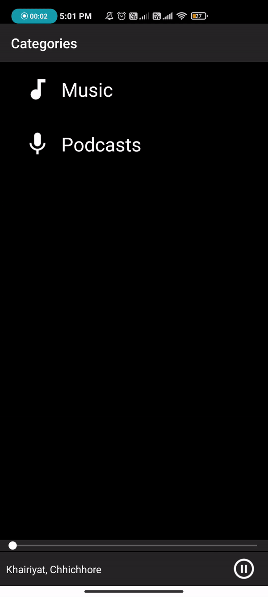
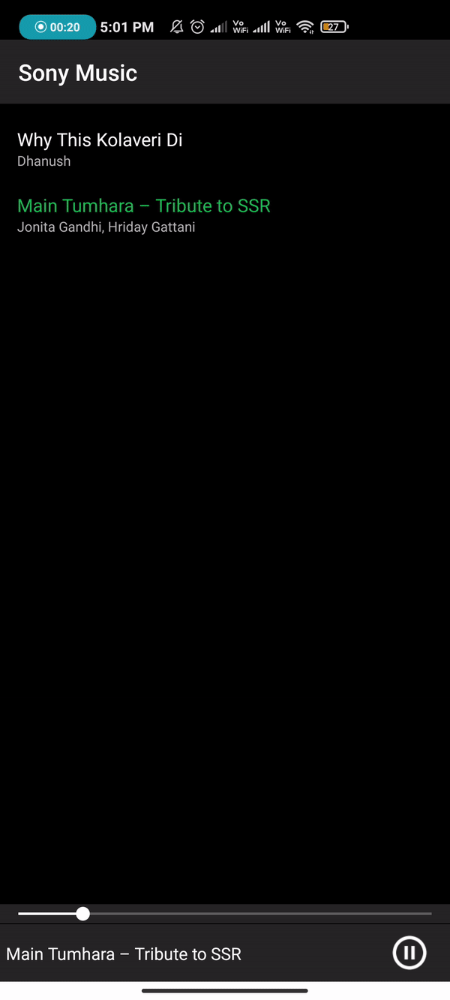
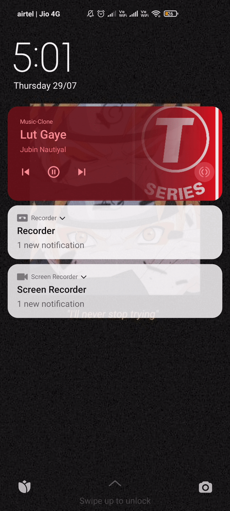
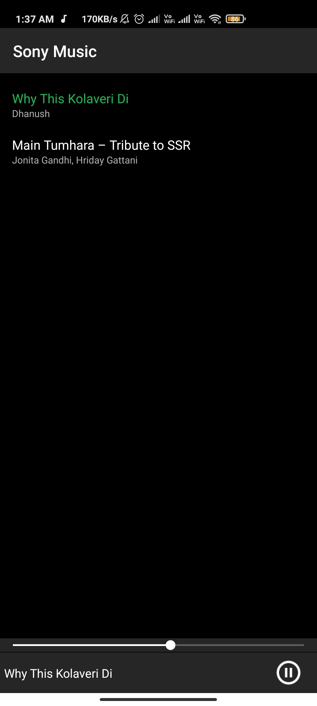
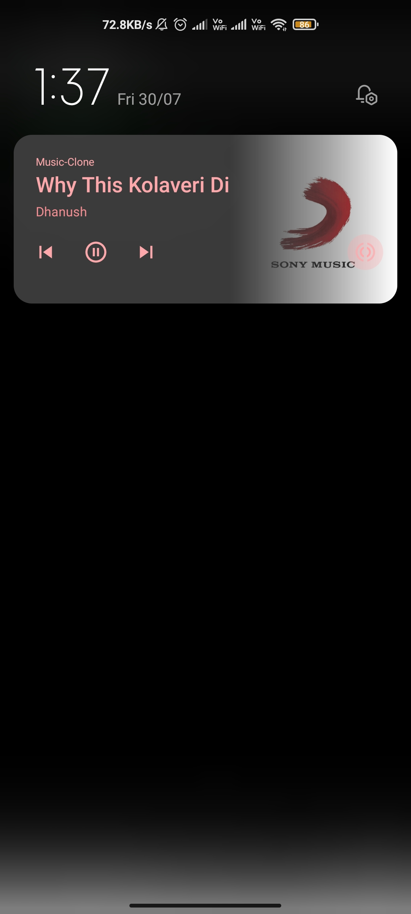
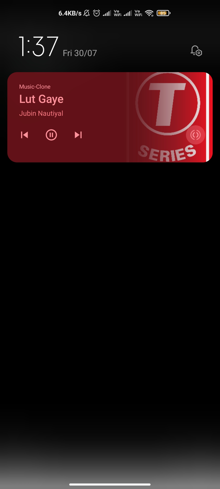
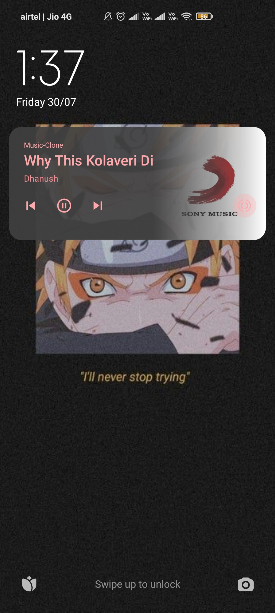

# Music Player On Android
I use the ExoPlayer library for streaming the audio files and Firebase Firestore to accumulate all the media resources.
## About
This app uses Foreground services for MediaSession, Broadcast Receivers for communicating Callbacks and updates, MediaServices (a class specifically built to stream media files)), Notification Manager, Glide library to download bitmaps, Asynctask, Custom SeekBar for audio timeline, and <a href = '#Used'>Much More </a>
### Installing
Clone this repo and build.

## Preview
&emsp; &emsp; &emsp;   &emsp; &emsp; &emsp; &emsp; &emsp;   &emsp; &emsp; &emsp;   
Fragment Management,Media Play &emsp; &emsp; &emsp; &nbsp; &nbsp; Controll Playback &emsp; &emsp; &emsp;&emsp;&nbsp; Lock Screen Controll

<table>
  
  <tr>
    <td>  </td>
    <td> <h2> Effective Fragment Management & Media Play</h2>  Fragments in here can handle backstack, The play and pause buttons are controll by Media Service depending on whether it's playing or paused, Using custom exo-player to play audio files which are loaded from firestore</td>
  </tr>
  
  <tr>
    <td> <h2> Notification & Media Services</h2>  Media Playback functionality is given by MediaService class, And we use it with Notification and other ExoPlayer playback options to play audio. Notification can change,pause or delete it self (if pause)</td>
    <td>  </td>
  </tr>
  
  <tr>
    <td>  &emsp;  </td>
    <td> <h2> Notification Callbacks and Views</h2>   The Notification Color changes according to the Artist selected in the app, Even lock screen can access callbacks through Notification. The callbacks for mediaplayer is desgined with Broadcast Receivers. </td>
  </tr>
  
</table>
 
 
## Projects Uses
- ExoPlayer (same media library used by YouTube in the mobile app)
- Streaming audio files from the internet (Firestore)
- Playlists
- Effective fragment management
- AsyncTasks
- SharedPreferences
-Effective communication with interfaces
- Services (a class specifically built to stream media files)
- Background Services that run forever
- Notifications
- Controlling playback through a notification
- Notifications and the lock screen
- Broadcast Receivers
- Glide library to download bitmaps
- RecyclerViews
- And much more...
